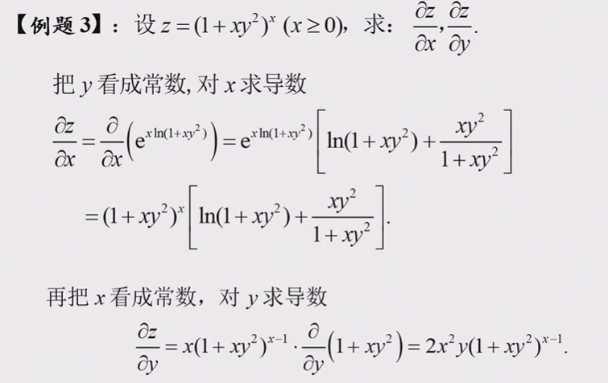
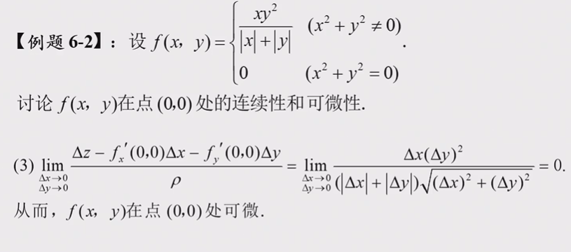
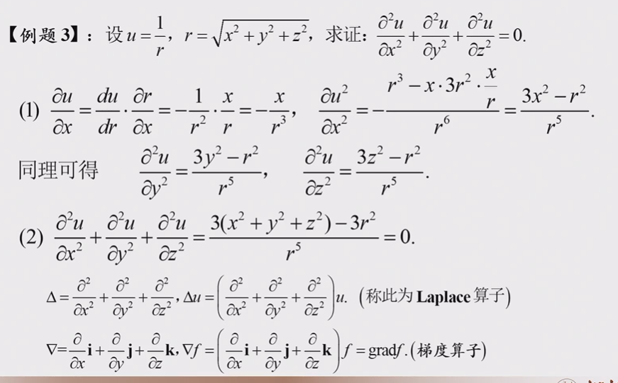
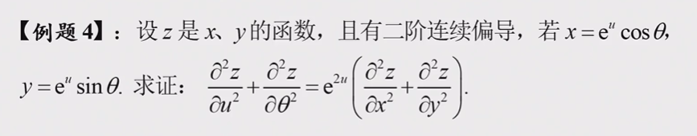
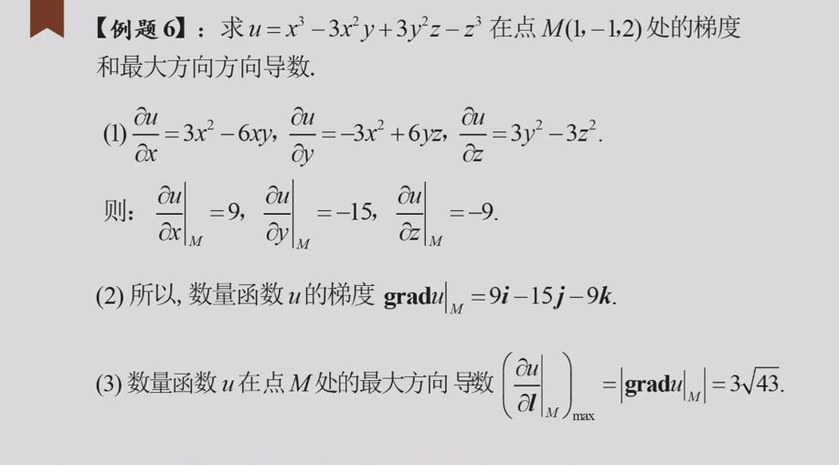
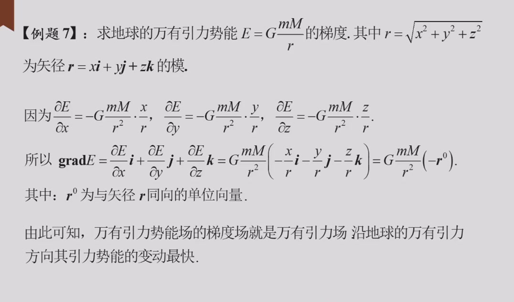

## 二元函数极限
### 使用定义求极限：

### 判断极限是否存在：

我推荐所有的这类极限判断都使用极坐标判断，只需要看$/theta$的函数是否有界即可，否则极限不存在。
如果极限结果是$/rho$的多项式，那么就需要一个一个看。
像这些就可以使用那种方法。这比归结原理好用的多。
可以对照着看。
#### 极限不存在：

#### 极限存在：

### 一般求极限的例题：
例题一：

思路：将$xy$视为一个整体，就是消元的思想。（换元可以视作一种消元）

例题二：

思路不变，整体看待，括号内无穷小，括号外有界。

### 求累次极限：
其实是定义问题，先x后y和先y后x两次求极限即可；
两道例题：

### 两个定理：
**累次极限和重极限之间没有必然的联系**
**若重极限、累次极限均存在，那么累次极限等于重极限。**

## 二元函数连续：

### 判断函数某点连续：
根据定义即可，其实还是求极限的问题；
一道例题：

**有界闭区间上的连续函数有最值定理和零点存在定理。**

## 非复合偏导数和微分：
### 求某点偏导数：
公式是最常见的，除了一些题会有不连续函数然后求偏导，那就必须要用定义了；
以下是例子：

#### 公式：
例题一：

解法：

### 连续、偏导、可微之间的关系(部分)：

### 求(高阶)偏导：
非复合函数求偏导，就是含参变量的求导；
低阶偏导：
高阶偏导：

**一阶连续偏导数说明二阶混合偏导相同**
例题：

二阶连续偏导数说明一阶连续，因此混合偏导相同，据此求导即可。

### 判断可微：
谨记定义；

### 求全微分：
和求偏导是一个德行，只是带上了d。

### 全增量和全微分之间的关系:

### 全微分方程：
定义；

求解方法：

另一个题：

## 复合函数的偏导和微分：
### 偏导：

一个竞赛背景的题：(蒲和平)

### 方程变换：
拿例子看：

这个题解析的思路是这样的：对于原来的函数，比较复杂；但我可以使用一些变换，使得函数形式在新变量下比较简单。现在我已知原变量下的一些性质，我希望根据这个性质来确定变换的系数。
根据变化前后的导数之间的关系，也就是复合函数的偏导数关系，我们就可以写出这些方程。

### 一个抽象的证明：

第二小问是算子形式；
这个齐次函数解决的思路我还没想好，先写写后面的。

### 另一例题：

## 隐函数的偏导：
公式：

实际情况中，建议直接对已知的函数式求个偏导，然后解方程，毕竟这只是一个线性方程组求解的问题。

### 一些例子：

微分法的一个例子：

### 奇怪的证明：

证明的条件：

## 隐函数组的偏导：
其实还是解方程组，那个行列式解就是克莱姆法则。

### 有关反函数的一个证明：

## 多元函数的极值以及泰勒展开：
### 无约束求极值
求极值是一类套题，无约束求极值就是求偏导数为0的点，然后根据海森矩阵或者负定性，去判断极值的类型；
一个例子：
对比一元函数的泰勒展开，二元函数的泰勒展开也可以用来求解多元函数的极值，我们只需要把一元函数的导数正负对应到矩阵的正定和负定即可，但对于三阶以上，涉及到更高维的(张量?)内容，我们不感兴趣。
### 条件极值：
条件极值使用拉格朗日乘数法即可，实质上没有区别，只需要记住拉格朗日乘数法的计算过程即可，以下是一个例子：

我们这里并未直接使用原距离公式作为乘数法选择的对象，只要有利于我们求出最终的结果的函数形式都可以，因此我们选择$r^2$
#### 闭区域条件极值
闭区域内的条件极值分两部分思考，边缘区域和内部区域。

### 抽象的例子：

这是一个圆锥曲线的例子，法一是射影的结果，比较难想；法二是直接求得椭圆的长轴和短轴，也就是距离的两个极值，因此可以算出截面面积。
### 求泰勒展开式：
最多求个二阶的，直接按照公式来求就可以了

注意要写余项

### 使用泰勒展开：
如题：

## 方向导数和梯度：
**方向导数和连续性之间没有必然联系**
一些反例：

### 求方向导数：

一个判断方向导数是否存在的例子：
根据定义即可。

### 梯度：
就是函数偏导的向量
F的梯度是其确定的隐函数的法向量；
一些简单例子

